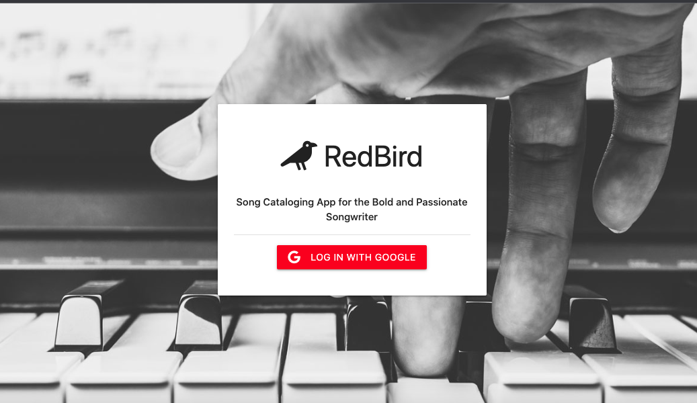

# RedBird 
## A Song Catalog Management App 

A simple and useful fullstack Song catalog management App, built for Songwriters to track and manage their songs, cowriters, metadata, and publishing information. RedBird is meant to help the songwriter stay organized and empowered by having their rights and important Song data saved all in one place.

**Link to project:** https://github.com/JamieLouBrolund/RedBird-Songs

> Be sure to add that lovely star 😀  and fork it for your own copy

---

# How it's made

**Tech used:** Handlebars, Materialize CSS, JavaScript, Node, Express, MongoDB, and Passport.js.

**Notable Dependencies:**

* connect-mongo (https://www.npmjs.com/package/connect-mongo)
   - Used to save cookie in database that allowed for user's session to persist.
* dotenv (https://www.npmjs.com/package/dotenv)
   - Intergration of .env file that allows protection and processing of environment variables.
* express-session (https://www.npmjs.com/package/express-session)
   - Middleware that aids formating of user session cookie data. Used in cooperation with 'connect-mongo' to store the session in the database.
* path (https://nodejs.org/api/path.html)
   - provides utilities for working with file and directory paths.
* mongoose (https://mongoosejs.com/)
   - Schema-based solution to model application data. Used to validate/organize database user and story entries.
* morgan (https://www.npmjs.com/package/morgan)
   - Node. js and Express middleware to log HTTP requests and errors. Used to simply process of testing/troubleshooting during development.
* passport (https://www.passportjs.org/)
   - Authentication middleware for Node.js. Used to modularize the authentication process with OAuth and Google login.
* passport-google-oauth20 (https://www.passportjs.org/packages/passport-google-oauth2/)
   - lets you authenticate using Google in your Node.js applications.
* Handlebars (https://handlebarsjs.com/)
   - embeded javascript templating language for the frontend.
* bcrypt (https://www.npmjs.com/package/bcrypt)
   - A library to help you hash passwords.
* Method-Override (http://expressjs.com/en/resources/middleware/method-override.html)
   - Lets you use HTTP verbs such as PUT or DELETE in places where the client doesn’t support it.
* Cloudinary (https://www.npmjs.com/package/cloudinary)
   - Cloudinary is an end-to-end image- and video-management API
---
# Optimizations

When I improve this project, I would start by updating the Add and Edit Song views to incorporate separate forms for different types of song metaData, and eventually expand into fully Released Recording Data. 

I would also like to include a capability to record audio into the app using the Audio Recorder Module for Node.js. Currrently, I have incorporated audio upload via Cloudinary for the audio feature. 

Lastly, I would like to add a 'public' and 'private' view for each Song, and add a secondary authenication method using the passport-local stategy. 

# Lessons Learned:

 My biggest challenge was incorporating audio upload with Cloudinary. Once I learned how the data was being taken in, how to setup the controller to listen to the request, and how to incorporate enctype form-data for my form, I had it working wonderfully.  

---

# How to Get it Working:

NPM Install for the Dependencies

Then add config.env file in the config folder with these values:
* PORT = 2121 //or whatever you choose
* MONGO_URI =  //MongoDB connection string
* GOOGLE_CLIENT_ID = // Google Auth ID
* GOOGLE_CLIENT_SECRET = // Google Auth secret
* CLOUD_NAME = // Cloudinary Cloud Name
* API_KEY = // Cloudinary key
* API_SECRET = // Cloudinary Secret
